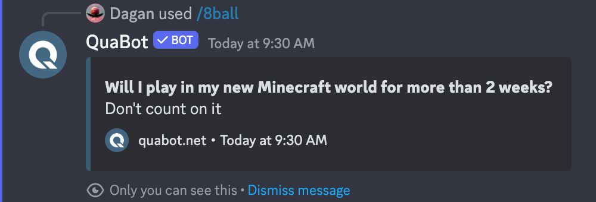

# Commands

An overview of every (sub)command, what it does and how to use it!

## Content

- [All Commands](#all-commands)
- [Fun Commands](#fun-commands)
  - [8ball](#8ball)
- [Info Commands](#info-commands)
  - [About](#about)
- [Module Commands](#module-commands)
  - [Afk](#afk)
    - [Help](#help)
    - [List](#list)
    - [Status](#status)
    - [Toggle](#toggle)

## All Commands

An overview of all (sub)commands.

<!-- - **Command:** The name of the command. **Example:** `channel`
- **Subcommand:** The name of the subcommand (if present). **Example:** `create`
- **Description:** What does the (sub)command do? **Example:** `Create a channel.`
- **Options:** The options that the command accepts (optional and required). **Example:** `name, nsfw` -->

<!-- !Not all hyperlinks are correct -->

| Command                       | Subcommand        | Description                                         | Options                                         |
| ----------------------------- | ----------------- | --------------------------------------------------- | ----------------------------------------------- |
| [8ball](#8ball)               |                   | Ask a question to the 8ball.                        | question                                        |
| [about](#about)               |                   | View some information about QuaBot.                 |                                                 |
| [afk](#afk)                   | [help](#help)     | Get some information about the afk module.          |                                                 |
| [afk](#afk)                   | [list](#list)     | See a list of AFK users in the server.              |                                                 |
| [afk](#afk)                   | [status](#status) | Set your AFK status.                                |                                                 |
| [afk](#afk)                   | [toggle](#toggle) | Set your AFK to enabled/disabled.                   | enabled                                         |
| [applications](#applications) | [apply](#apply)   | Apply for an application.                           |                                                 |
| [applications](#applications) | [help](#help)     | Get some information about the applications module. |                                                 |
| [applications](#applications) | [list](#list)     | See a list of forms in the server.                  |                                                 |
| [applications](#applications) | [manage](#manage) | Manage server forms.                                |                                                 |
| [avatar](#avatar)             | [server](#server) | Get the icon of the server.                         |                                                 |
| [avatar](#avatar)             | [user](#user)     | Get a user's avatar.                                | user                                            |
| [ban](#ban)                   |                   | Ban a user.                                         | delete_messages, private, reason, user, user-id |

## Fun Commands

A detailed description of every command in the `fun` category.

### 8ball

The 8ball command answers a question that you ask it about the future, you're the only person who can see the response.

<!--  -->

<!-- ! how to change size? -->

An overview of all the options that the command uses.

| Option   | Description            | Required | Type |
| -------- | ---------------------- | -------- | ---- |
| question | What is your question? | Yes      | Text |

## Info Commands

A detailed description of every command in the `info` category.

### About

Detailed description

Img

## Module Commands

A detailed description of every command that belongs to a module.

### Afk

used to manage afk etc.

#### Help

Detailed description

Img

#### List

Detailed description

Img

#### Status

Detailed description

Img

#### Toggle

Detailed description

Img

An overview of all the options that the command uses.

| Option  | Description  | Required | Type       |
| ------- | ------------ | -------- | ---------- |
| enabled | Are you AFK? | Yes      | True/False |
