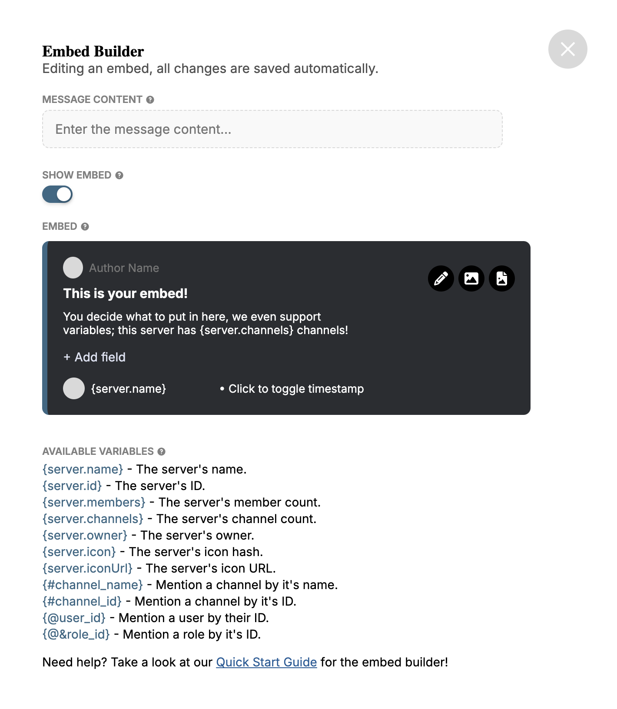
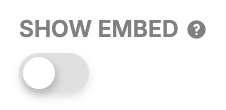
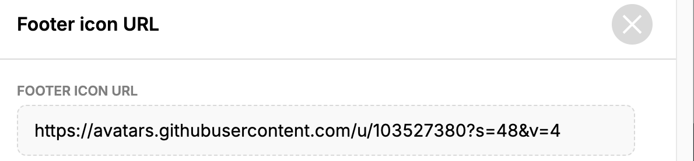

# Embed Builder

A detailed explanation of the `Embed Buider`.

The `Embed Builder` is used in a lot of modules, so it is very important that you have a good understanding of how it works.

## Contents

- [Embed Builder](#embed-builder)
  - [Contents](#contents)
  - [The basics](#the-basics)
  - [Advanced Usage](#advanced-usage)
    - [Variables](#variables)
  - [FAQ](#faq)

## The basics

Let's start with the basics.

1. When you see a box with `Edit in Embed Builder` on the dashboard, you can always click it.
2. When the box is clicked, it'll open up the `Embed Builder`. 
   

3. If you want any normal text in your message, then you can enter it in the `Message Content` field.
<!-- !doesn't work yet, insert picture -->
4. If you don't want an embed, be sure to turn off `Show Embed`. 
   

5. If you do want an embed, you can edit all of it's properties by simply clicking on them and editing the text! 
   

6. If you want to see how the final embed looks, you can always click the cross icon. 
   

7. The `Embed Builder` will be closed and you'll be able to see the `Preview` window. 
   

You now have a basic understanding of the `Embed Builder`.

## Advanced Usage

You'll learn all of the `Embed Builder`'s features!

8. You can add multiple fields in an embed, you can do this by clicking on `Add field` and editing the text.
<!-- !doesn't work yet, insert picture -->
9. To change the visibility of the timestamp , click on `Click to toggle timestamp`. 
   

10. An embed has a lot of possibility for images, try to click on the grey circles in the author and footer. 
    

11. A pop-up will appear and you'll have to enter the URL of an image. 
    

12. When you've entered your URL, you can close the pop-up.
13. You can add even more images when you click on the `Change Thumbnail` and `Change Image` icons. 
    

14. You can also change the color on the left side of the embed when you click on the `Change Embed Color` icon. 
    

You now know all of the settings in the `Embed Builder`.

### Variables

The `Embed Builder` has a lot of useful variables that you can use anywhere in your embed!

The variables that you can use are different for every module, but there are some variables that you can always use. 

When you enter the variable in your message, it'll automatically be replaced with the real data! The first few basic variables are `static`, this means that the user can't directly change the variable. **Example:** `{server.name}`, this data can only be changed when you edit the name of your server.

There also are `dynamic` variables, these variables' data can directly be changed, it matters what you enter in it. **Example:** `{@&role_id}`, this will be replaced with a mention of the role that you enter.

## FAQ

- **Question:** Why is the data that replaces my variables in the `Preview` window incorrect? 
  **Answer:** A lot of the variables will be replaced with placeholder data in the `Preview` window, but don't worry! The real message will have the right data.

- **Question:** The variable preview isn't showing up? 
   **Answer:** The variable preview is not always visible, so it will correctly show up on the final message, just not in the preview.