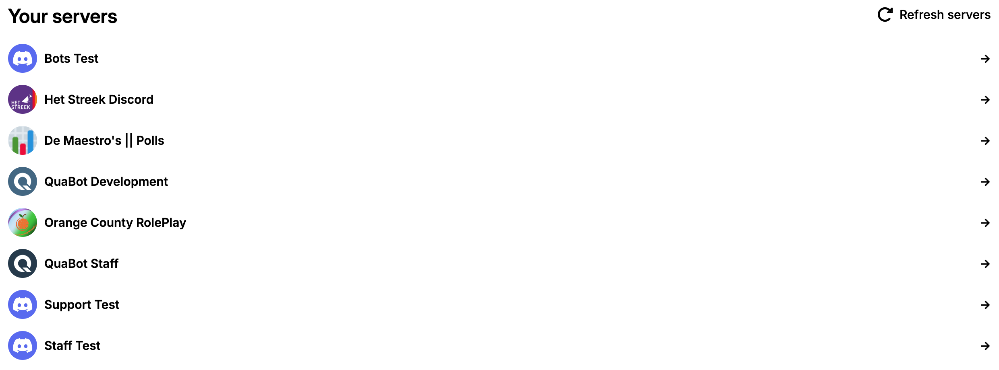
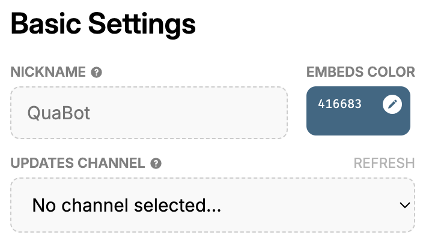
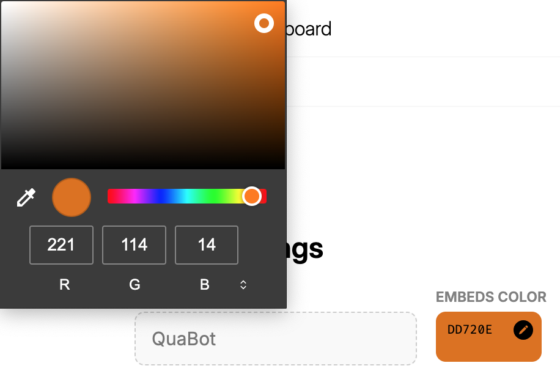
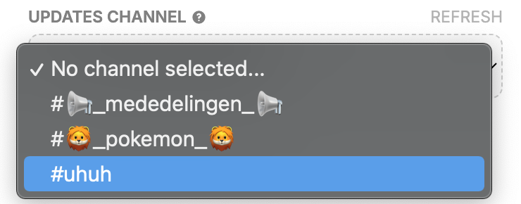
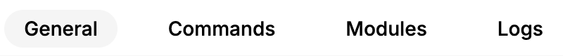
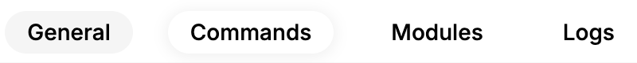
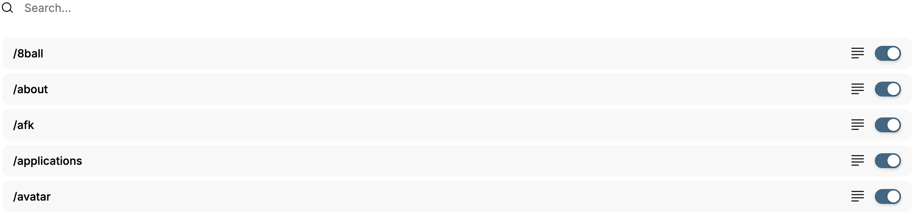
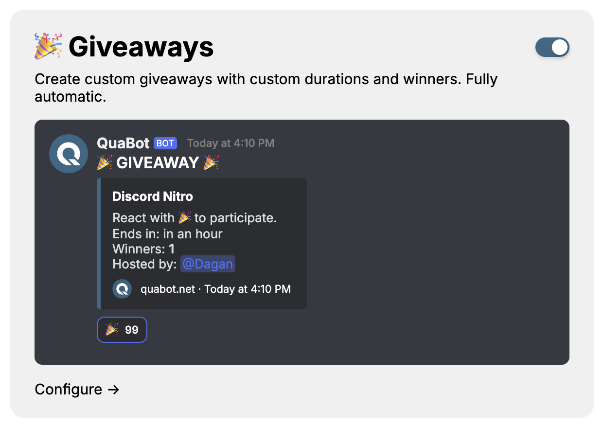
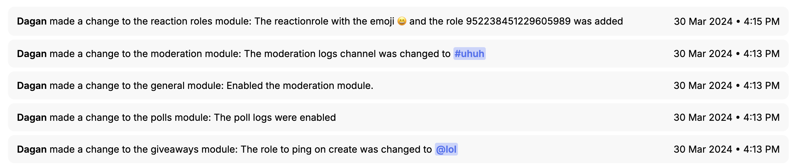

# Getting Started

A guide to using the QuaBot dashboard.

1. To configure QuaBot, visit the [dashboard](https://quabot.net/dashboard).
2. Once there, you’ll see a list of servers where you have the `Manage Server` permission. 
   
3. Select the server where you'd like to set up QuaBot.
4. After selecting your server, you'll be directed to the `Basic Settings` page, where you can start configuring the bot. 
   
5. To customize the appearance, click the `Embeds Color` box and choose your server’s primary color. 
   
6. Select the channel where you’d like to receive QuaBot updates. 
   
7. Always remember to save your changes! 
   
8. Use the navigation bar at the top of the screen to move around the dashboard. 
   
9. Navigate to the `Commands` page via the navigation bar. 
   
10. On this page, you can enable or disable specific commands. For a detailed explanation of each command, visit the [commands page](/docs/commands). 
    
11. After choosing the commands, head over to the `Modules` page. 
    
12. On this page, you can activate the modules you want to use. For detailed explanations of each module, explore the [modules section](/docs/category/modules).
13. To configure a module, click the `Configure` button at the bottom of each module box. 
    
14. Once you’ve set up the modules, visit the `Logs` page to track changes made in the server. 
    
15. The `Logs` page will show all changes made to QuaBot settings within the server. 
    

Congratulations! You now have a solid understanding of how to navigate and configure QuaBot using the dashboard. For more assistance, feel free to check out the [FAQ](https://quabot.net/faq).
