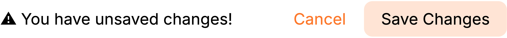

# Getting Started

A guide for the dashboard.

1. To configure QuaBot you'll have to use the [dashboard](https://quabot.net/dashboard).
2. When you click the link, you'll be greeted with all of the servers where you have the `Manage Server` permission in. 
   
3. Choose the server where you'd like to use QuaBot in.
4. When you've chosen the server, you'll see the page where you can configure the `Basic Settings` of the bot. 
   
5. Click on the `Embeds Color` box and select the main color of your server. 
   
6. Select the channel where you'd like to get updates about QuaBot. 
   
7. Never forget to save your changes! 
   
8. With the bar at the top of your screen you can navigate around the dashboard. 
   
9. Navigate to the `Commands` page with the button in the bar. 
   
10. On this page you can choose which commands you'd like to be enabled, for a detailed explanation of every command you can visit this wiki's [commands page](/docs/commands) 
    
11. When you're done with choosing commands, you can navigate to the `Modules` page. 
    
12. On this page you can choose which modules you'd like to use, for a detailed explanation of every module you can visit this wiki's [modules category](/docs/category/modules)
13. You can configure each module by clicking on the `Configure` button at the bottom of the module. 
    
14. When you've configured all the modules that you'd like to use, you can go to the `Logs` page. 
    
15. On this page you can see all changes to QuaBot that have been made in this server. 
    

Congratulations! You now have a good understanding of QuaBot's dashboard, if you need help you can always take a look at the [FAQ](https://quabot.net/faq).
