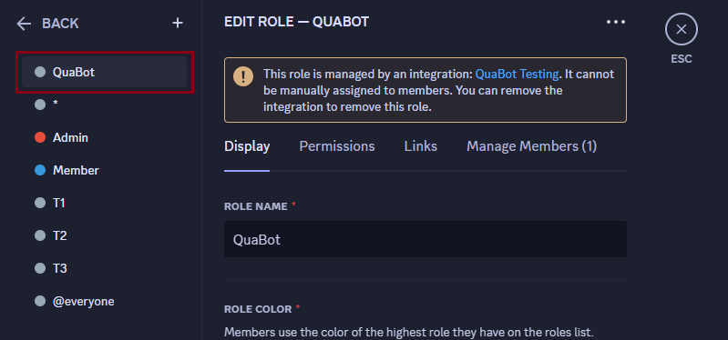

# The QuaBot Wiki

Welcome to the QuaBot wiki, this wiki is created to help you use QuaBot.

QuaBot is the perfect Discord bot, it has advanced modules ranging from giveaways, reaction roles, logging to applications and so much more.

## Inviting QuaBot

You can invite QuaBot to your server by visiting [invite.quabot.net](https://invite.quabot.net). You can also join our [support server](https://discord.quabot.net) for help and support.

When inviting QuaBot, it will prompt you to select the server you want to invite it to. Select the server and click continue.
You then need to select a few permissions, which are pre-selected.
After selecting the server, you will be taken to the dashboard where you can configure the bot. More info about getting started with the dashboard can be found [here](/docs/getting-started).

## Required Permissions

:::info Using Administrator Permissions
You can use the Administrator permission. This will make sure QuaBot works, but it is not required, and you should not give Administrator to bots/users you do not trust.
:::

QuaBot requires the following permissions to work properly:

| Permission                                | Reason                                                                                                 |
| ----------------------------------------- | ------------------------------------------------------------------------------------------------------ |
| `Manage Channels`                         | Required to move, add and edit channels, for the tickets module and various commands.                  |
| `Manage Roles`                            | Required to add and remove roles, for the reaction roles module and various commands.                  |
| `Manage Messages`                         | Required to delete messages, for the (including but not limited to) the moderation and automod module. |
| `View Channels`                           | Required to view channels, for the logging module.                                                     |
| `Read Message History`                    | Required to read message history, for the logging module.                                              |
| `Send Messages`                           | Required to send messages, for the bot to respond to commands, and have various modules work.          |
| `Send Messages in Threads`                | Required to send messages, for the bot to respond to commands, and have various modules work.          |
| `Embed Links`                             | Required to send embeds, and have various modules working properly, including our social poster.       |
| `Use External Emojis`                     | Required to use external emojis, for the reaction roles module and various statistics commands.        |
| `Add Reactions`                           | Required to add reactions, for the reaction roles module.                                              |
| `Kick Members`                            | Required to kick members, for the moderation module.                                                   |
| `Ban Members`                             | Required to ban members, for the moderation module.                                                    |
| `Timeout Members`                         | Required to ban members, for the moderation module.                                                    |
| `Attach Files`                            | Required to send files, for example for ticket transcripts.                                            |
| `Mention @everyone, @here, and All Roles` | Required to mention everyone, for example to ping staff in tickets.                                    |
| `Adminstrator` (Optional)                 | Gives all permissions, makes sure QuaBot always works.                                                 |

## QuaBot Role Position

:::caution Warning
Please make sure that the QuaBot role is above all roles it should manage. If the role is below for example the members role, it cannot give this role to members. (More info below)
:::

QuaBot requires the `QuaBot` role to be above all roles it should manage. This is to ensure that QuaBot can manage the roles properly. If the role is below for example the members role, it cannot give this role to members. You can move the role by dragging it in the role list in the server settings. If you're having trouble with this, you can always ask for help in our [support server](https://discord.quabot.net).

## Contributing

You can contribute to this wiki by visiting the [GitHub repository](https://github.com/quabot/wiki). You can also join our [support server](https://discord.quabot.net) for help and support.

This wiki is created by the QuaBot team, with the help of the community. We would like to thank everyone who has contributed to this wiki.
