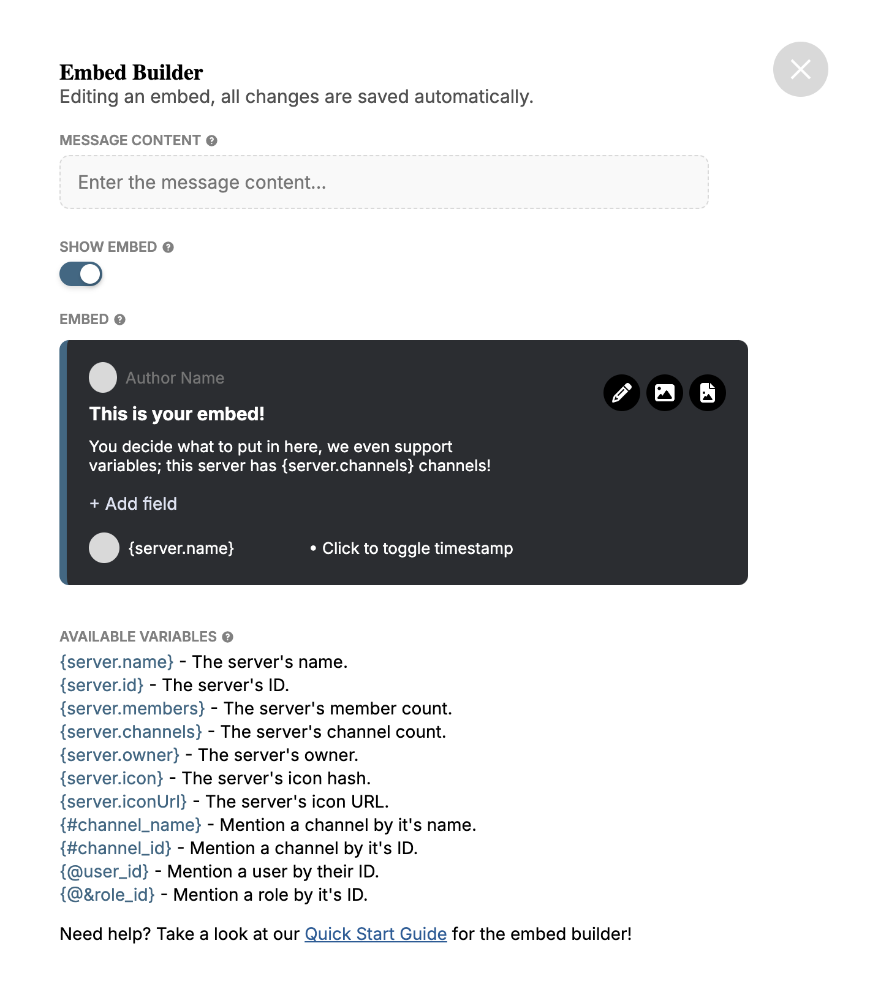
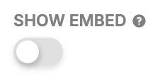
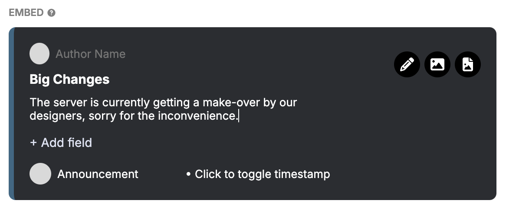
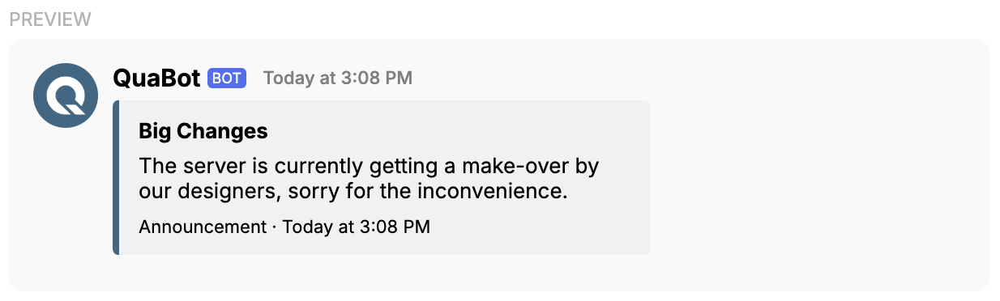
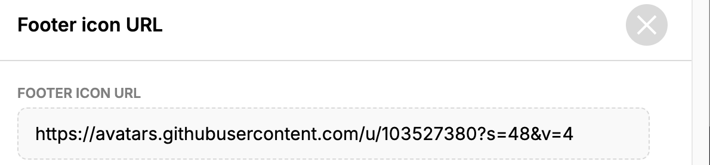
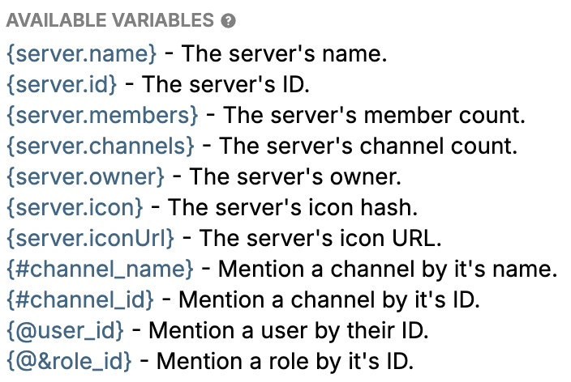

# Embed Builder

The `Embed Builder` is a versatile tool used across many modules, so it's essential to understand how it works.

## Contents

- [Embed Builder](#embed-builder)
  - [Contents](#contents)
  - [The Basics](#the-basics)
  - [Advanced Usage](#advanced-usage)
    - [Variables](#variables)
  - [FAQ](#faq)

## The Basics

Let's go over the basics of the `Embed Builder`:

1. On the dashboard, when you see a box with "Edit in Embed Builder," you can click it.
2. Clicking the box opens the `Embed Builder`. 
   <!--  -->

3. To add plain text to your message, enter it in the `Message Content` field.

4. If you don't need an embed, turn off `Show Embed`. 
   <!--  -->

5. To edit an embed, click any of its properties to modify the text. 
   <!--  -->

6. To preview the embed, click the cross icon to close the `Embed Builder`. 
   <!--  -->

7. You'll then see the final embed in the `Preview` window. 
   <!--  -->

You now know the basics of using the `Embed Builder`.

## Advanced Usage

Now let’s dive into more advanced features of the `Embed Builder`:

8. You can add multiple fields to an embed by clicking `Add Field` and editing the text.

9. To toggle the visibility of the timestamp, click on `Click to toggle timestamp`. 
   <!--  -->

10. You can add images by clicking the grey circles in the author and footer sections. 
    <!--  -->

11. A pop-up will appear where you can enter the URL of an image. 
    <!--  -->

12. Once you've entered the URL, close the pop-up to continue editing.

13. You can also add a thumbnail and a larger image by clicking the `Change Thumbnail` and `Change Image` icons. 
    <!--  -->

14. To change the color of the embed, click the `Change Embed Color` icon on the left side. 
    <!--  -->

With these steps, you now know all the settings of the `Embed Builder`.

### Variables

The `Embed Builder` also supports a range of useful variables, which can be used in your embed.

Different modules have different available variables, but some are universal. 
<!--  -->

When you enter a variable in your message, it'll automatically be replaced with the appropriate data. 

- **Static variables**: These can't be changed directly by the user.  
  **Example:** `{server.name}` will show the server's name.
  
- **Dynamic variables**: These can be changed based on user input.  
  **Example:** `{@&role_id}` will mention the role based on the role ID you provide.

## FAQ

- **Q:** Why does the `Preview` window show incorrect data for variables? 
  **A:** In the `Preview` window, many variables are replaced with placeholder data. The final message will display the correct values.

- **Q:** Why isn't the variable preview showing up? 
  **A:** The variable preview doesn't always display in the builder, but it will show up in the final message.