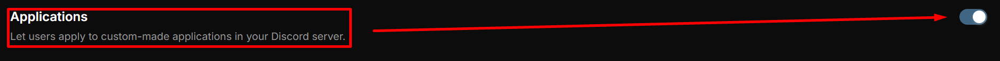
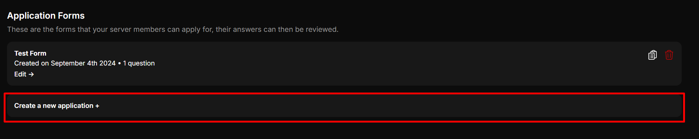
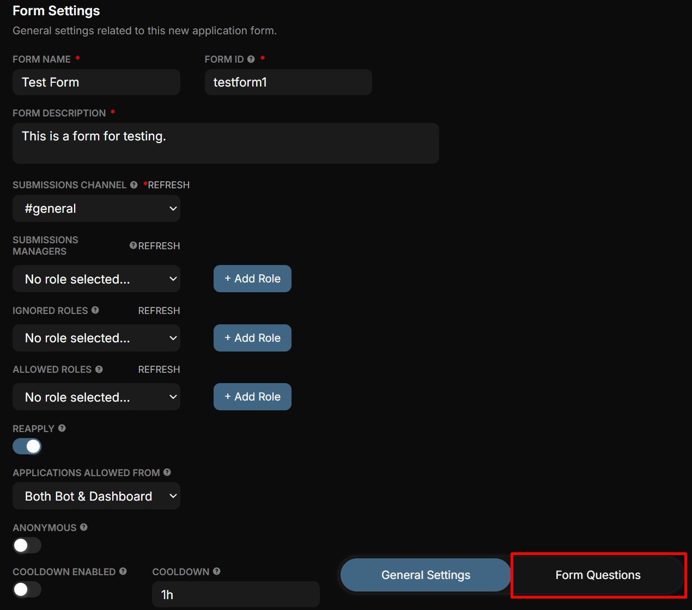
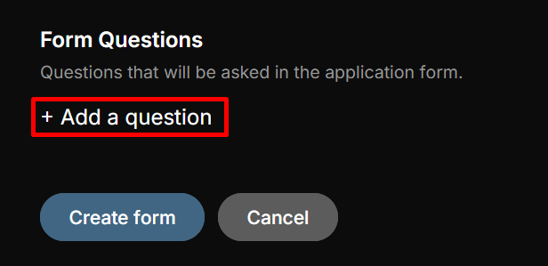
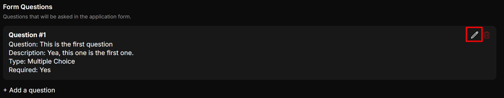
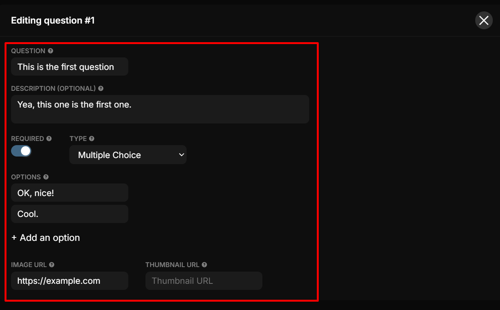
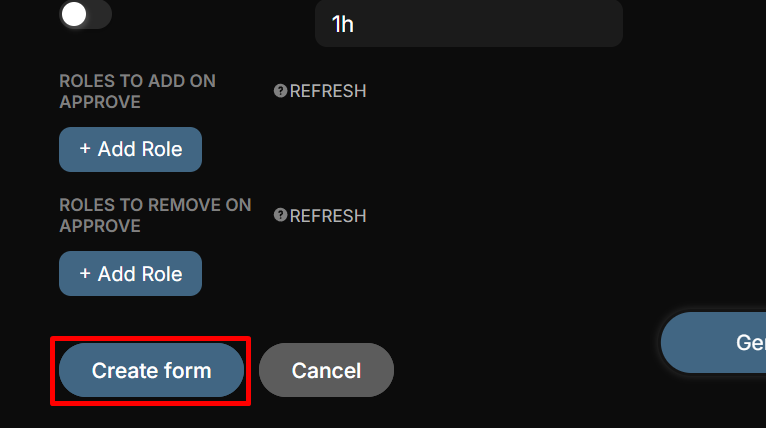

# 📋 Applications

Allow users to apply for custom-made roles or opportunities in your Discord server.

-----------

### Application Forms

**Follow these steps to learn how to create and manage Application Forms:**

1. **Enable or Disable the Module**  
   Toggle the module on or off:  
   

2. **Create a New Application Form**  
   Click on `Create a new application +` to start building a form.  
   

3. **Configure Form Settings**  
   A new window will open for form settings. These settings apply only to the current form you're creating:
   - **Form Name**: The name of the form. _Required_
   - **Form ID**: Assign a unique ID to the form. _Required_
   - **Form Description**: Add details or instructions about the form. _Required_
   - **Submissions Channel**: Select the channel where all responses will be sent for review. _Required_
   - **Submissions Managers**: Users with the selected role can approve or deny applications. _Admins are exempt from this restriction._
   - **Ignored Roles**: Users with the selected role are **not** allowed to fill out the application. This acts as a blacklist. _Admins are exempt from this restriction._
   - **Allowed Roles**: Users with the selected role are the **only** ones allowed to fill out the application. This acts as a whitelist. _Admins are exempt from this restriction._
   - **Reapply**: Allow users to apply multiple times if enabled.
   - **Applications Allowed From**: Choose where users can submit applications:
     - **Bot Only**: Applications can only be submitted via the Discord bot.
     - **Dashboard Only**: Applications can only be submitted via the web dashboard.
     - **Both Bot & Dashboard**: Applications can be submitted via both the Discord bot and the web dashboard.
   - **Anonymous**: If enabled, applications will be submitted anonymously.
   - **Cooldown Enabled**: Limit how often users can apply.
     - **Cooldown**: Set the time users must wait before applying again. _(Format: 1h, 30min, 1d)_
   - **Roles to Add on Approve**: Specify roles that QuaBot should add when an application is approved.
   - **Roles to Remove on Approve**: Specify roles that QuaBot should remove when an application is approved.

4. **Create Form Questions**  
   To continue building your form, click on the `Form Questions` tab:  
   

5. **Add Questions**  
   In the new tab, click `Add a question` to start creating questions for the form.  
   

6. **Edit Questions**  
   Click the pencil icon to edit the question:  
   

7. **Customize Each Question**  
   Fill in the following fields:
   - **Question**: The question the user needs to answer.
   - **Description**: Provide additional details or context for the question.
   - **Required**: Make the question mandatory if enabled.
   - **Type**: Select the question type:
     - Short Text
     - Paragraph Text
     - Multiple Choice
     - Checkboxes
     - Yes/No
   - **Image URL**: Insert a URL of an image to be displayed with the question.
   - **Thumbnail URL**: Insert a URL of a thumbnail image to be displayed with the question.  
   

8. **Add More Questions**  
   Continue adding questions as needed.

9. **Finalize the Form**  
   Once you've added all your questions, click on **`Create Form`** to finalize the form.  
   

Congratulations! You now have a basic understanding of how to use the Application Module.
