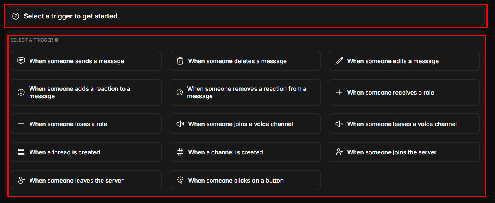
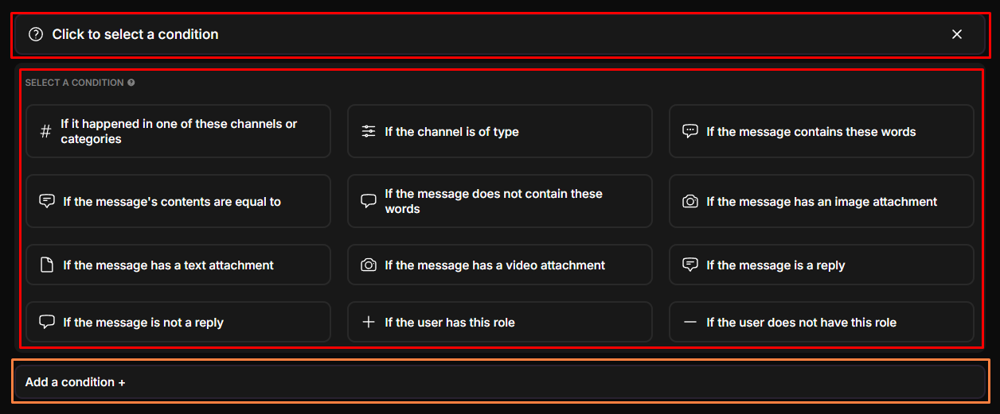
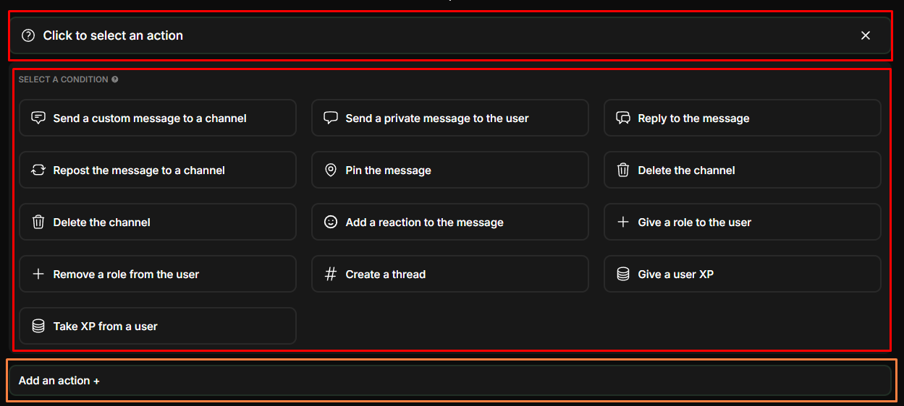
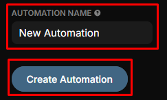

# ✨ Automation

Automatically execute actions based on various triggers and conditions, creating your own custom modules.

-----------

### Create an automation sequence

**Follow the steps below to learn more about creating a new automation sequence:**

1. **Select trigger**  
   Select a trigger to get started: 
   _This is what will trigger this automation sequence. Each trigger has corresponding if's and actions that it can take._

      - When someone sends a message.
      - When someone deletes a message.
      - When someone edits a message.
      - When someone adds a reaction to a message.
      - When someone removes a reaction from a message.
      - When someone receives a role.
      - When someone loses a role.
      - When someone joins a voice channel.
      - When someone leaves a voice channel.
      - When a thread is created.
      - When a channel is created.
      - When someone joins the server.
      - When someone leaves the server.
      - When someone clicks on a button.

> :::note
> You may only select up to **1** trigger per automation sequence.
> :::

------------------

2. **Select a Condition**  
   _The conditions are checks that need to be passed, before a sequence will run. If a condition check fails, the sequence will be stopped_
   
   You may add/select 1 or more of the following conditions:

   - **If it happend in one of these channels or catagories**, _choose 1 or more Channels/Categories._
   - **If the channel is of type**, _choose a channel type._
   - **If the message contains these words**, _add 1 or more words to the condition._
   - **If the message's contents are equal to**, _enter a custom message._
   - **If the message does not contain these words**, _add 1 or more words to the condition._
   - **If the message has an image attachment.**
   - **If the message has a text attachment.**
   - **If the message has a video attachment.**
   - **If the message is a reply.**
   - **If the message is not a reply.**
   - **If the user has this role**, _add 1 or more roles to the condition._
   - **If the user does not have this role**, _add 1 role to the condition._

   
   
---------

3. **Select an action**  
   _The actions are the actions that will be executed when all the conditions are matched._
   
   - **Send a custom message to a channel**, _select a channel, Edit the embed message (with buttons)._
   - **Send a private message to the user**, _edit the embed message (with buttons)._
   - **Reply to the message**, _edit the embed message (with buttons)._
   - **Repost the message to a channel**, _select the repost channel._
   - **Pin the message.**
   - **Delete the channel.**
   - **Delete the channel.**
   - **Add a reaction to the message**, _choose the emoji that will be added to the message._
   - **Give a role to the user**, _select the role that will be added to the user._
   - **Remove a role from the user**, _select the role that will be removed from the user._
   - **Create a thread**, _enter a name for the thread, <u>optional: edit the embed message (with buttons)</u>._
   - **Give a user XP**, _enter the amount of XP to be added to the user._
   - **Take XP from user**, _enter the amount of XP to be removed from the user._

> :::note
> You may only add up to **5** actions per automation sequence.
> :::

   

----------

4. **Automation Name**  
   Enter in a name for the automation and press `Create Automation`.  
   

--------------

### Automation Presets

**Here is a list of available Automation Presets:**

1. **Simple Starboard**  
   Automatically repost a message to another channel when it receives 5 star emojis.  

2. **Support Threads**  
   Create a thread when a user sends a message that indicates they need help from a staff member.  

3. **Edited Message Indicator**  
   When someone edits their message, the bot will add a pencil reaction to show that the message has been edited.  

4. **Thread Joiner**  
   When a thread is created, add staff members and send a message to the thread.  

Congratulations! You now have a basic understanding of how to use the Automation Module.