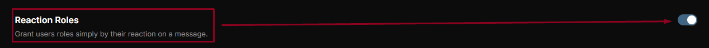
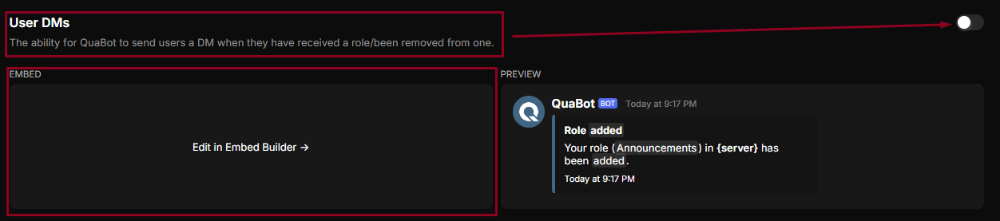
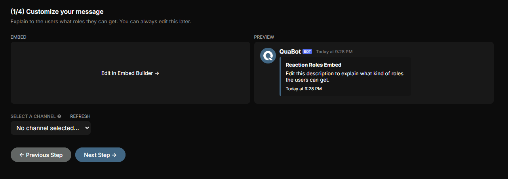

# 😃 Reaction Roles

Easily assign roles to users based on their reactions to specific messages.

-----------

### General Settings

**Reaction Roles**  
Allow users to receive roles by simply reacting to a message.

Enable or disable the module:  

**User DMs**  
Let QuaBot notify users via DM when they gain or lose a role.

Enable or disable User DMs. To customize the DM message, click `Edit in Embed Builder`:  

-----------

### Setting Up Reaction Roles

To begin setting up Reaction Roles, click the `Reaction Roles` tab at the bottom of the page.

A new window will guide you through the step-by-step process:  

