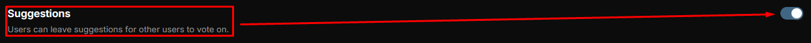
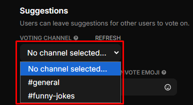
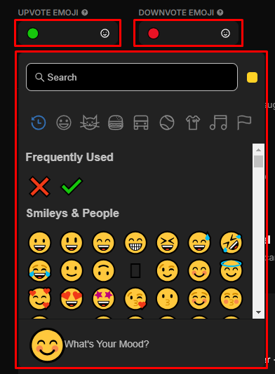
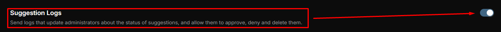
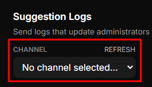
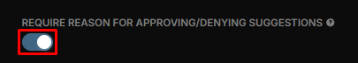
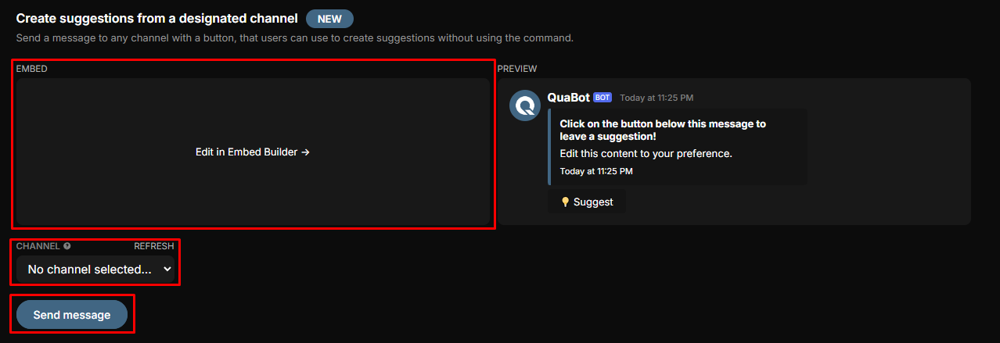
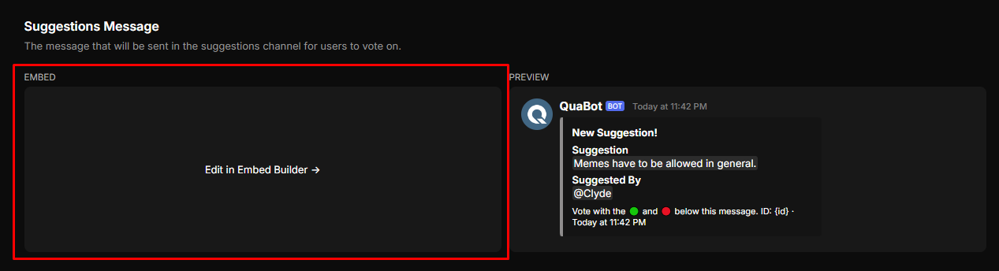
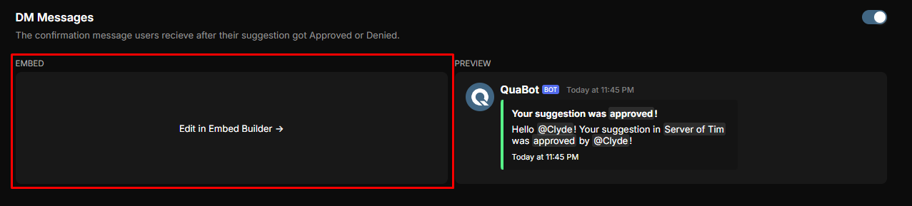

# 💡 Suggestions

Allow users to suggest features or ideas for your server and vote on them.

-----------

### Suggestions Setup

**Follow these steps to set up and manage Suggestions in your server:**

1. **Enable or Disable the Module**  
   Toggle the Suggestions module on or off:  
   

2. **Select Voting Channel**  
   Choose the channel where suggestion messages will be sent for users to vote on.  
   

3. **Choose Upvote and Downvote Emojis**  
   Select which emojis will be used for upvoting and downvoting suggestions:  
   

4. **Enable or Disable Suggestion Logs**  
   Send logs to administrators to track the status of suggestions. These logs allow admins to approve, deny, or delete suggestions.  
   

5. **Select Suggestion Logs Channel**  
   Choose the channel where the suggestion logs will be sent.  
   

6. **Require Reason for Approving/Denying Suggestions (Staff Only)**  
   Decide if staff must provide a reason before approving or denying suggestions. The reason will be displayed with the suggestion.  
   

----------
### Create Suggestions from a Designated Channel

You can set up a message with a button in a channel that users can click to create suggestions, without needing to use a command.

Edit the Embed Message to your liking, and send it to a selected channel:  

---------
### Embed Messages

1. **Suggestions Message**  
   Edit the message that will be sent in the suggestions channel for users to vote on.  
   

2. **DM Messages**  
   Customize the confirmation messages users receive after their suggestion is approved or denied.  
   

:::note
Don't forget to save your changes!
:::

Congratulations! You now have a basic understanding of how to use the Suggestions Module.
