# 🎫 Tickets

Users can create their own support channel where staff can administer support.

-----------

**Follow these steps to learn how to set up the Tickets Module:**

### General Settings

1. **Enable or disable the Module**  
   Toggle the module on or off:  
   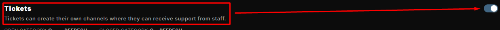

2. **Choose categories for open and closed tickets**  
   Click on `No Category selected..` to choose a category for both open and closed tickets.  
   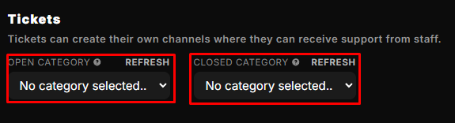

3. **Staff Settings**  
   Automatically add staff members and ping them when a new ticket gets created:
   - **Staff Roles** - _These roles will be added to new tickets when they are created._
   - **Staff Ping** - _The role that will be pinged upon the creation of a new ticket, the support team for example._  
   

4. **Ticket Limit**  
   The maximum amount of tickets there can be open at once: 
   - **Server Ticket Limit** - _The amount of tickets there can be open in the server at one time._
   - **User Ticket Limit** - _The amount of tickets a single user can have open at a time._  
   _Zero (0) = Unlimited_  
   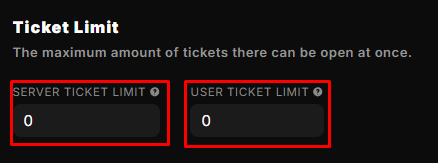

5. **Auto Closure & Reminders**  
   Automatically close tickets or remind the owner to respond if they're inactive for a while:
   - **Auto Reminder** - _Remind the ticket owner to respond if they're inactive for a set amount of time._
      - **Reminder After Days** - _Set the number of days of inactivity after which Quabot will remind the ticket owner to reply._
   - **Auto Closure** - _Close the ticket if it’s inactive for a set amount of time._
      - **Close After Days** - _Set the number of days of inactivity after which Quabot will close the ticket._

   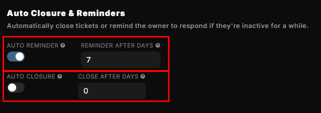

6. **Additional Settings**  
   Additional settings related to the tickets module:
   - **Automatically delete ticket when closed** - _When the ticket is closed for any reason, the system will automatically delete it when enabled._
   - **Topic for tickets required** - _Users will be required to provide a topic for their ticket to let staff know what it’s about._

   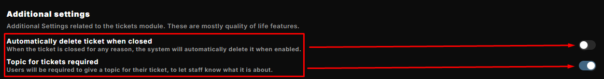

:::note
Don't forget to save your changes!
:::

------

### Logs & Direct Messages

1. **Ticket Logs**  
   Toggle the Logs on or off:  
   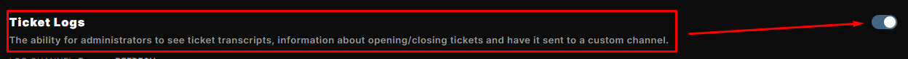

2. **Choose a Log Channel**  
   Click on `No channel selected..` to choose a channel where the ticket logs will be sent.  
   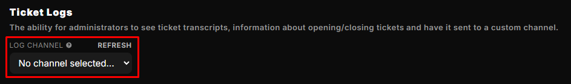

3. **Ticket Log Events**  
   Decide which events and actions will be logged to the ticket logs channel:

   - **Ticket Closure** - _When tickets are closed by anyone._
   - **Ticket Deletion** - _When tickets are deleted._
   - **Ticket Reopening** - _When tickets are reopened._
   - **Ticket Creation** - _When tickets are created._
   - **User/Role Added** - _When users or roles are added to tickets._
   - **User/Role Removed** - _When users or roles are removed from tickets._
   - **Ticket Updated** - _When the topic for a ticket is changed._
   - **Ticket Transferred** - _When ticket ownership is transferred._
   - **Ticket Claimed** - _When a ticket is claimed by a staff member._
   - **Ticket Unclaimed** - _When a ticket is no longer claimed by a staff member._

   

4. **Ticket DM Events**  
   Turn DM Events on or off:  
   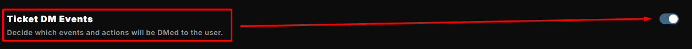

   Decide which events and actions will be DMed to the user:

   - **Ticket Closure** - _When tickets are closed by anyone._
   - **Ticket Deletion** - _When tickets are deleted._
   - **Ticket Reopening** - _When tickets are reopened._
   - **Ticket Creation** - _When tickets are created._
   - **User/Role Added** - _When users or roles are added to tickets._
   - **User/Role Removed** - _When users or roles are removed from tickets._
   - **Ticket Updated** - _When the topic for a ticket is changed._
   - **Ticket Transferred** - _When ticket ownership is transferred._
   - **Ticket Claimed** - _When a ticket is claimed by a staff member._
   - **Ticket Unclaimed** - _When a ticket is no longer claimed by a staff member._

   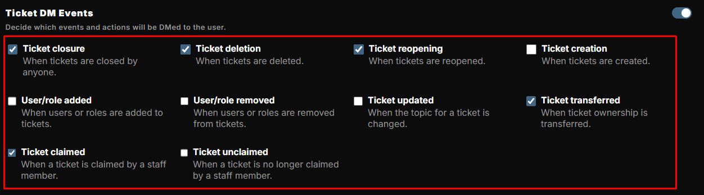

:::note
Don't forget to save your changes!
:::

-----

### Ticket Message

Using this tool, you can send a message to a channel. This message has a button that users can use to create a new ticket.

1. **Edit the message in Embed Builder**  
   Edit the message where users can create a ticket with a click of a button.  
   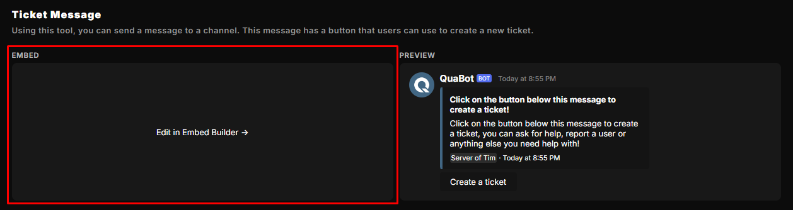

2. **Select Channel**  
   Click on `No channel selected..` to choose a channel where the ticket message will be sent.  
   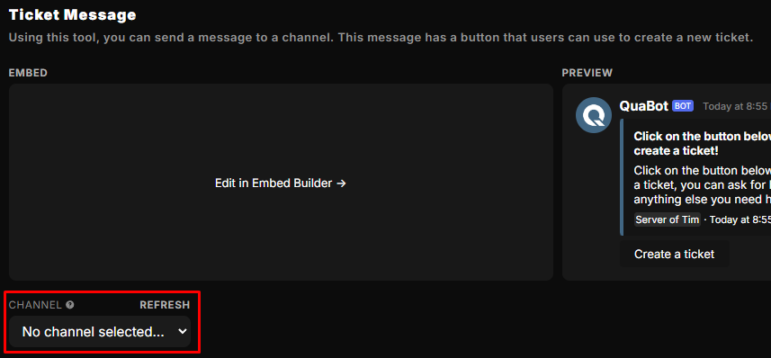

3. **Send Message**  
   Send the custom message to the selected channel.  
   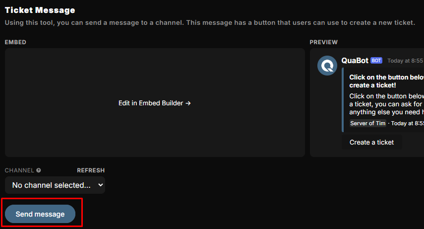
   
:::tip
_For more details on how to use the Embed Builder, visit the [Embed Builder page](/docs/embed-builder)._
:::

:::note
Don't forget to save your changes!
:::

-----

Congratulations! You now have a basic understanding of how to use the Tickets Module.
