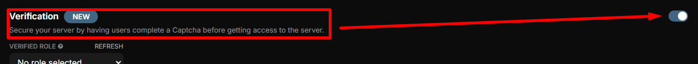
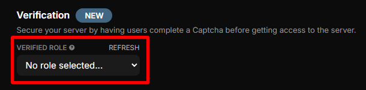
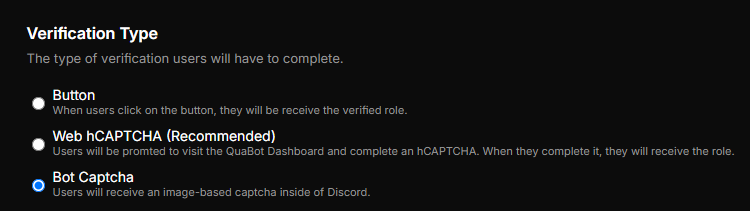
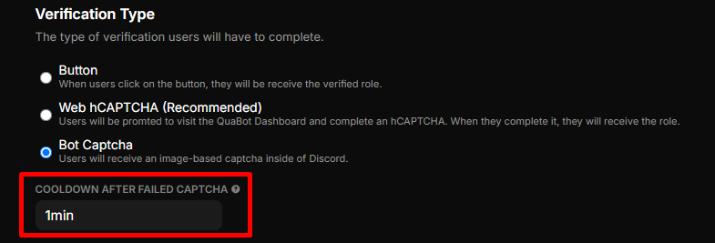
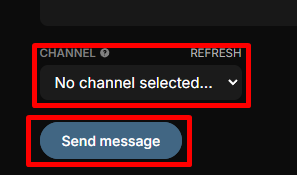

# ✅ Verification

Enhance the security of your server by requiring users to complete a Captcha before gaining access.

-----------

### Verification Setup

**Follow these steps to learn how to set up and manage Verification in your server:**

1. **Enable or Disable the Module**  
   Toggle the Verification module on or off:  
   

2. **Select Verified Role**  
   Choose the role that will be assigned once users complete the verification process.  
   

3. **Choose a Verification Type**  
   Select how users will be verified:
   - **Button**: Users click a button to receive the verified role.
   - **Web hCAPTCHA (Recommended)**: Users will be directed to the QuaBot Dashboard to complete an hCAPTCHA. Once verified, they receive the role.
   - **Bot Captcha**: Users will receive an image-based captcha directly in Discord.  
   

4. **Set Cooldown After Failed Captcha**  
   Define how long users must wait before retrying after failing a captcha.  
   

5. **Edit Embed Message - _Required_**  
   Customize the verification message that will be sent to users. Click `Edit in Embed Builder` to modify the message.  
   

6. **Select Channel and Send the Message**  
   Choose the channel where the verification message will be sent, and then click `Send Message` to deploy it.  
   

7. **DM Verification - _Optional_**  
   Optionally, send a DM to new members to help them verify quickly. Note that not all users may receive a DM from QuaBot.  
   Click `Edit in Embed Builder` to customize this DM message.  
   

:::note
Don't forget to save your changes!
:::

Congratulations! You now have a basic understanding of how to use the Verification Module.
