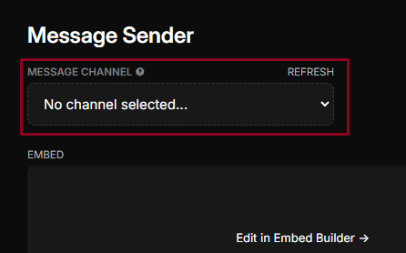
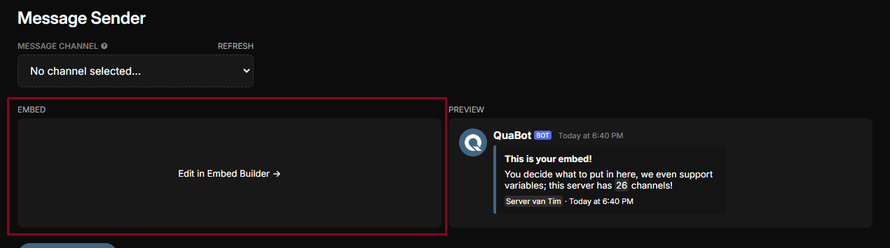

# 📝 Message Sender

Want to send a polished message? Use QuaBot to send it directly to your channel!

**Follow the steps below to learn more about the Message Sender:**

1. **Select the channel** where you'd like to send a message:  
   

2. Click `Edit in Embed Builder` to customize the message you want to send:  
   

3. **Edit the message** to your preference.  
   For more details on how to use the Embed Builder, visit the [Embed Builder page](/docs/embed-builder).  
   

4. Once satisfied, click `Send message` to post your message in the selected channel:  
   

:::tip
Under **`Previously Sent Messages`**, you can view all the messages you’ve sent to a channel!
:::

Congratulations! You now have a basic understanding of how to use the Message Sender.
