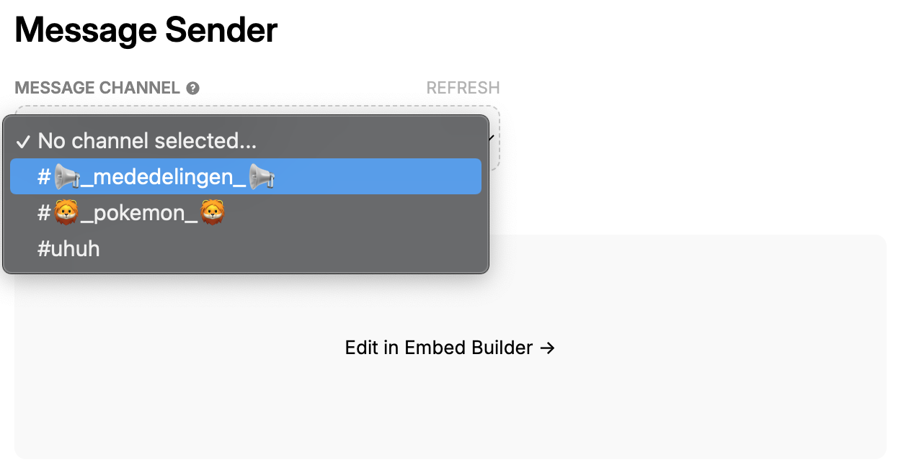
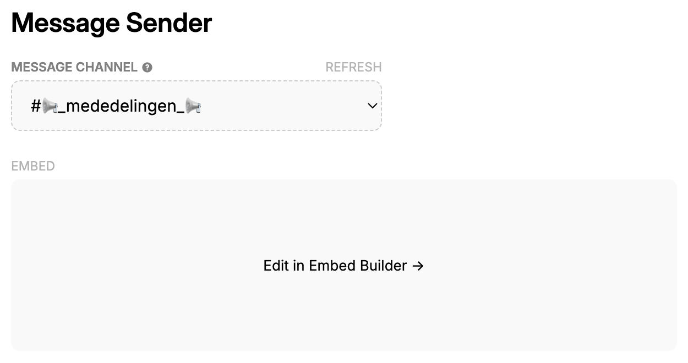

# Message Sender

<!-- - How does the module work -->

With the message sender you can easily let the bot send a message to a channel in your server.

<!-- - What does it do -->
<!-- - How to use it with Setup on Dashboard -->

The message sender is very easy to use.

1. Select the channel where you'd like to send a message to.
   
2. Click on `Edit in Embed Builder`.
   
3. Enter your message.
   
4. Click on `Send Message`.

- Explain the different settings
- Commands
- Troubleshooting
