# 👋 Welcome

Easily send personalized welcome messages to new server members, either in a designated channel or via direct message.

---------------

### Join Messages
Welcome new members to your server with a custom message when they join.

1. **Select the Welcome Channel**  
   Choose the channel where all welcome messages will be sent.  
   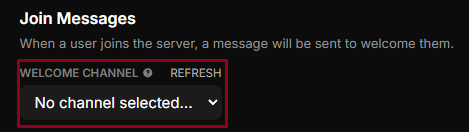

2. **Choose Message Type**  
   Decide whether you want to send the welcome message as a card or an embed.  
   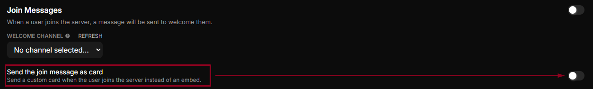

3. **Customize the Message**  
   - For an embed message, click `Edit in Embed Builder`.
   - For a card message, click `Edit in Card Builder`.  
   
   More information on using the Embed Builder can be found on the [Embed Builder page](/docs/embed-builder).  
   A quick start guide for the Welcome Card Builder is available [here](/docs/welcome-card-builder-quickstart).  
   
   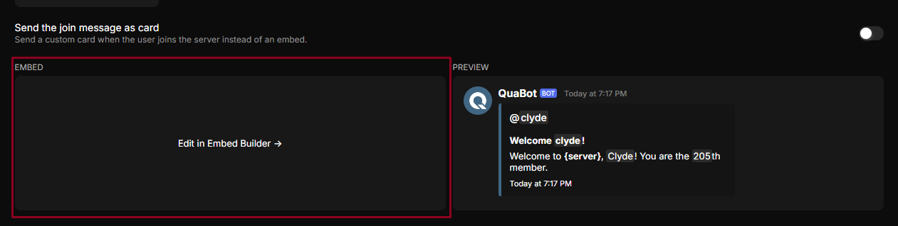
   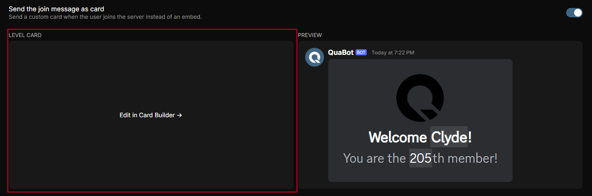

:::note
Remember to save your changes.
:::

----------

### Join Roles
Automatically assign roles to new members upon joining.

1. **Access Join Roles Settings**  
   Click the 'Join Roles' tab at the bottom of the page.

2. **Assign Roles**  
   - Specify which roles QuaBot should assign to new members.
   - Set a delay (in milliseconds) before roles are assigned.
   - Indicate if the selected roles should only be given to bots.

   > Click `Add Role` to assign additional roles to new members.

   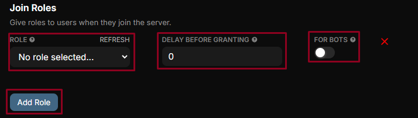

-------------

### Join DMs
Send a direct message to new members when they join the server.

1. **Enable Join DMs**  
   Toggle to send a DM to new members when they join.  
   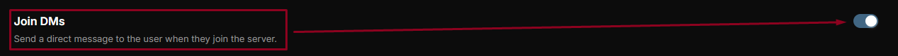

2. **Choose Message Type**  
   Decide whether the Join DM should be a card or an embed.  
   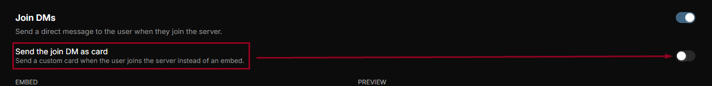

3. **Customize the Message**  
   - For an embed message, click `Edit in Embed Builder`.
   - For a card message, click `Edit in Card Builder`.  
   
   More details on using the Embed Builder are on the [Embed Builder page](/docs/embed-builder).  
   A quick start guide for the Welcome Card Builder is available [here](/docs/welcome-card-builder-quickstart).  
   
   
   

:::note
Remember to save your changes.
:::

--------

### Leave Messages
Notify the server when a user leaves, with a custom farewell message.

1. **Select the Leave Channel**  
   Choose the channel where all leave messages will be sent.  
   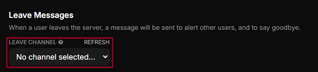

2. **Choose Message Type**  
   Decide whether the leave message should be a card or an embed.  
   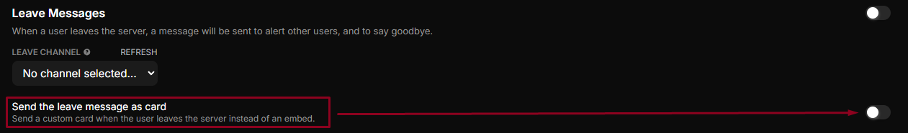

3. **Customize the Message**  
   - For an embed message, click `Edit in Embed Builder`.
   - For a card message, click `Edit in Card Builder`.  
   
   More details on using the Embed Builder are on the [Embed Builder page](/docs/embed-builder).  
   A quick start guide for the Welcome Card Builder is available [here](/docs/welcome/welcome-card-builder).  
   
   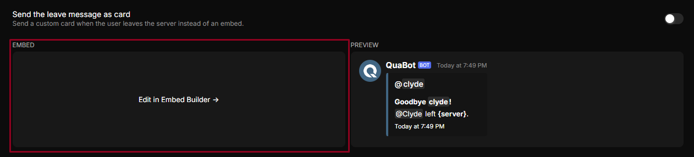
   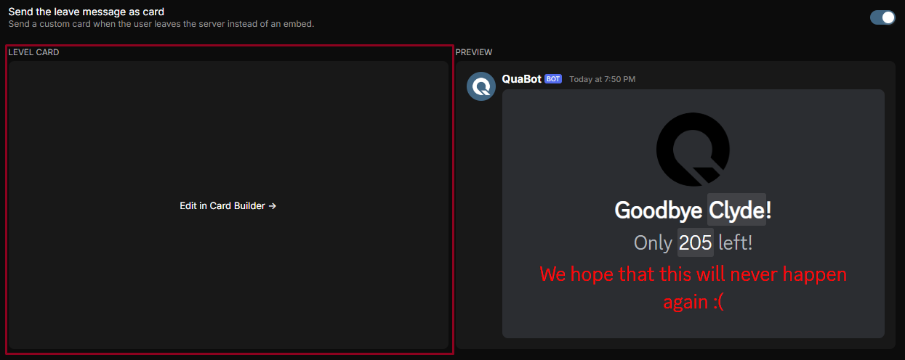

:::note
Remember to save your changes.
:::
