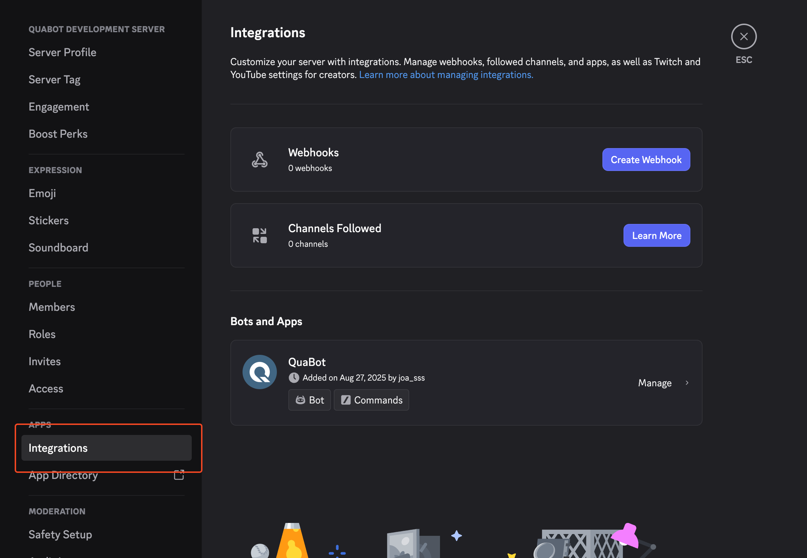
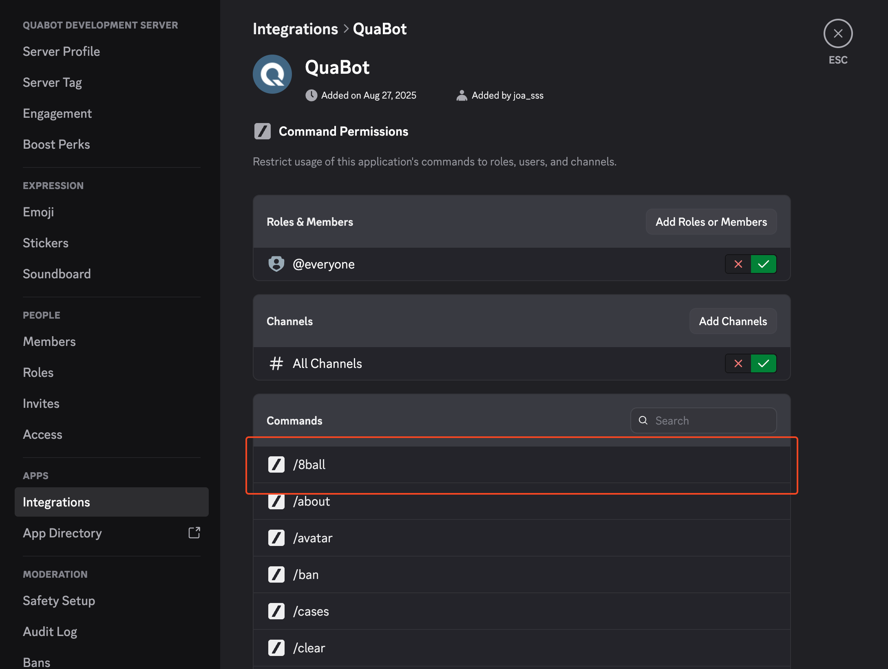
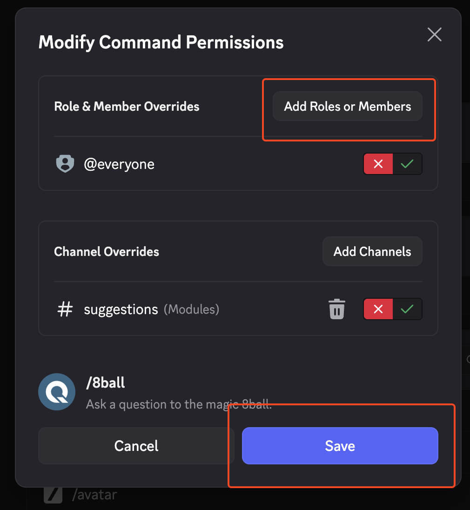
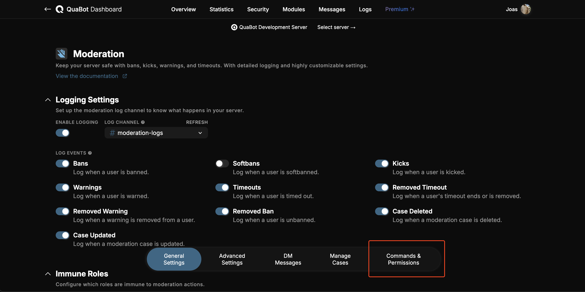
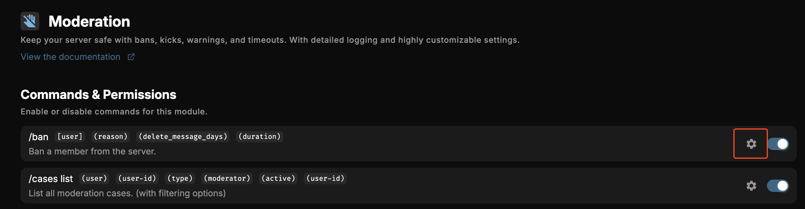
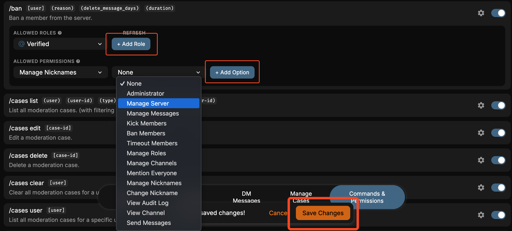

# Permissions

Permissions are essential in managing your Discord server and keeping it secure. They allow you to control what members can and cannot do within your server. This guide will help you understand how to set up and manage QuaBot's permissions effectively.

## Required Permissions
To ensure that QuaBot functions correctly, it needs the following permissions:
- **Manage Server**: Allows QuaBot to manage server settings and configurations, including automod.
- **Manage Roles**: Enables QuaBot to create, edit, and delete roles as needed for moderation, lockdown, and other features.
- **Manage Channels**: Allows QuaBot to create, edit, and delete channels for various functionalities such as tickets.
- **Kick Members**: Permits QuaBot to kick members from the server when necessary (moderation).
- **Ban Members**: Permits QuaBot to ban members from the server when necessary (moderation).
- **Change Nickname**: Allows QuaBot to change its nickname in the server for better identification. (optional)
- **View Channel**: Allows QuaBot to see channels and read messages for audit logs and more.
- **Moderate Members/Timeout Members**: Allows QuaBot to timeout members for moderation purposes.
- **Send Messages**: Enables QuaBot to send messages in channels for communication and notifications.
- **Create Public Threads**: Allows QuaBot to create public threads for discussions, tickets and suggestions.
- **Create Private Threads**: Allows QuaBot to create private threads for discussions, tickets and suggestions.
- **Send Messages in Threads**: Enables QuaBot to send messages in threads for communication and notifications.
- **Manage Messages**: Allows QuaBot to delete messages, pin messages, and manage messages for moderation purposes.
- **Manage Threads**: Allows QuaBot to archive, unarchive, and delete threads for better organization.
- **Embed Links**: Allows QuaBot to send embedded links in messages for better presentation.
- **Attach Files**: Enables QuaBot to attach files in messages for sharing documents and images.
- **Read Message History**: Allows QuaBot to read past messages in channels for context and moderation.
- **Add Reactions**: Enables QuaBot to add reactions to messages for starboard and various other modules.
- **Mute Members**: Allows QuaBot to mute members in voice channels for moderation purposes.
- **Move Members**: Allows QuaBot to move members between voice channels for moderation purposes.

We highly recommend granting these permissions to ensure that QuaBot can operate smoothly and provide all its features. You can also give QuaBot Administrator permissions, which will automatically grant all the necessary permissions, although this is not required.

## Command Permissions
QuaBot has multiple ways to grant permissions to use certain features and it might be a bit confusing.
### 1. Handle permissions via Integrations
You can manage each QuaBot command's permissions via Discord's built-in integration system. This allows you to specify which roles or members can use specific commands. You can even restrict commands to certain channels if needed. Here's how to do it:
1. Go to your server settings and click on Integrations, then select the QuaBot bot.

2. Click on the command you want to manage permissions for out of the list. This list shows all QuaBot commands, excluding subcommands (Eg. /suggestion create will only show /suggestion).

3. From here, you can add or remove roles and members to control who can use the selected command. You can also restrict the command to specific channels by selecting "Only in selected channels" and choosing the desired channels.

### 2. Handle moderation permissions via QuaBot Dashboard
For moderation commands, you can/need to manage permissions via the QuaBot Dashboard. This allows you to set up roles that can use moderation commands like kick, ban, mute, etc, as well as permissions that are allowed to use it. Users only need to have one of the roles assigned to them, or have any of the permissions, to be able to use moderation commands. Here's how to set it up:

1. Visit the configuration page of the Moderation module in the [QuaBot Dashboard](https://quabot.com/dashboard). Not sure how to get there? Check out our [Getting Started Guide](./getting-started.md). Once there, navigate to the "Commands & Permissions" tab.

2. In this tab, you will see a list of commands that are part of the Moderation module. You can select which commands you want to enable or disable by toggling the switch next to each command. But we want to change permissions, so you need to click on the cogwheel icon next to the command you want to manage permissions for to open the permissions & roles dropdown.

3. Finally, you can select the roles and permissions that will allow users to use the selected command. Users only need to have one of the roles assigned to them, or have any of the permissions, to be able to use the command. Make sure to click "Save Changes" at the bottom when you're done.

### 3. Button & Select Menu Permissions
Some commands and modules, like suggestions and some others use buttons and select menus to interact with them. These interactions do not show up in the integration command list and cannot easily be managed. Most of the time these are a part of moderation for example, and they will inherit the required permissions from those commands. Other cases, like suggestions, will use a list of default permissions that the user needs to have to be able to use them. Most of the time these permissions are:
- Administrator
- Manage Messages
- Manage Server

Each module that uses buttons or select menus will sometimes have a list of permissions that are required to use them in their documentation. If you cannot find it, please reach out to our [support server](https://discord.quabot.net). We hope to replace this with a better system in the future but since we cannot manage these permissions in Discord itself we opted to do this instead of configuring each button and select menu individually.

## Do you need additional support?
Most commands should have either of these two ways to manage permissions, but some commands might only have one of them. If you have any questions or need help, feel free to reach out to our [support server](https://discord.quabot.net). We're here to help you get the most out of QuaBot!