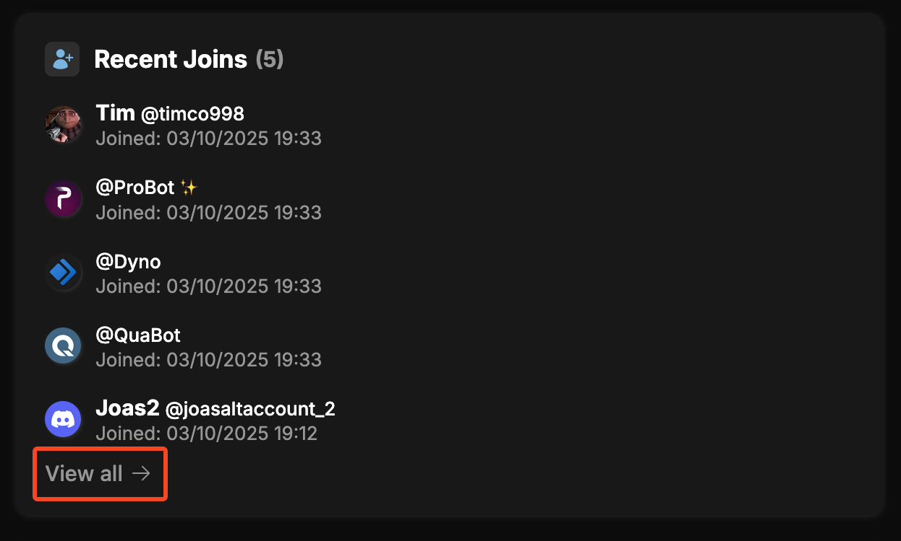

# Security Overview
Welcome to the Security Overview! Here you can find all the important security information about your server in one place. This includes suspicious joins, moderation cases, action logs, automod logs, statistics, verification and dashboard logs. We are looking to expand this page in the future with more security related information and features, but for now this is a good starting point to keep an eye on the security of your server. Let's take a look at each section in more detail.

## Joins & Leaves
### Recent Joins & Leaves
This section shows you 2 lists, one with the most recent joins and one with the most recent leaves. This is useful to keep an eye on who is joining and leaving your server. You can click on "View all" to see the full list of recent joins and leaves, as seen below:

### Suspicious Joins & Accounts
:::note Suspicious Joins and Accounts are in beta
We're still collecting data and feedback to improve and fine-tune our detection system.
:::

This section shows you the most recent suspicious joins and a list of all suspicious accounts in your server. Suspicious accounts are accounts that have been flagged by QuaBot's suspicious account detection system. This system checks for various criteria to determine if an account is suspicious, such as account age, profile picture, username, and activity. You can click on "View all" to see the full list of suspicious joins and accounts, as seen below:

## Moderation Cases

## Action Logs

## Automod Logs

## Statistics

## Verification

## Dashboard Logs