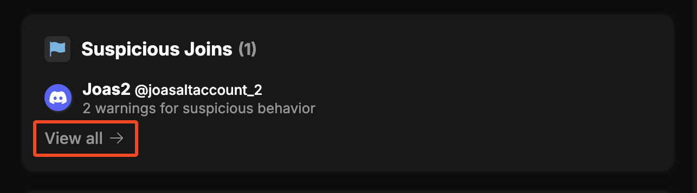
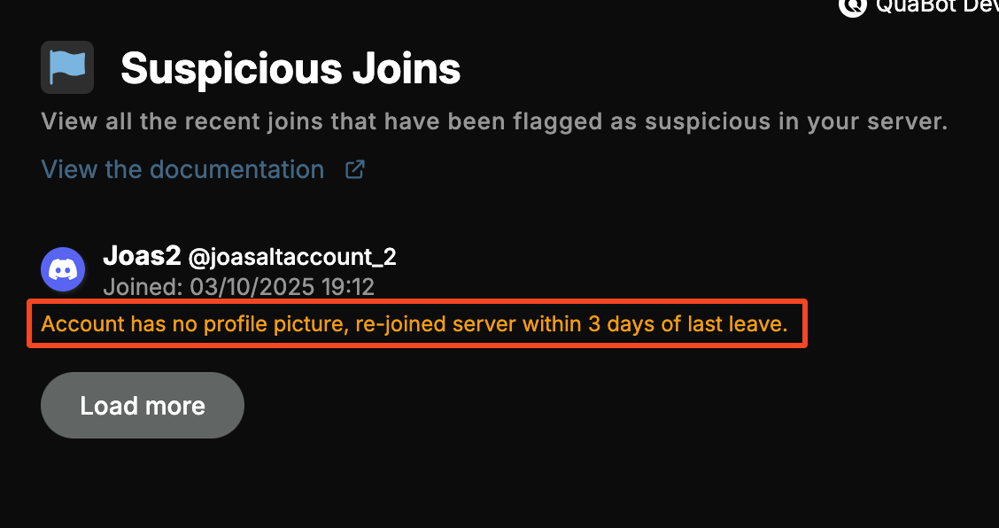

# Suspicious Joins and Accounts

:::note
This module is in beta! We're still collecting data and feedback to improve and fine-tune our detection system. Please let us know if you have any suggestions or if you think some users were falsely flagged.
:::

Whenever a new user joins your server QuaBot will run a few checks on the account to see if it might be suspicious. If it is, you will be able to see a list of suspicious joins on the Security Panel. Additionally, QuaBot will check existing accounts every hour to see if they are suspicious as well. This is useful for catching accounts that were created a while ago but only recently joined your server. This page explains this feature and how it works.

## What makes an account suspicious?
QuaBot will run a checklist on the account, each item gives a certain amount of points. If the account scores more than a certain amount of points it will be marked as suspicious. Some items give more points and some give less, in order to prevent false positives. The list of criteria is as follows:
- Account is less than 7 days old.
- Account is less than 30 days old.
- Account has no profile picture.
- Account is not online, has no status on join (offline, invisible).
- Username contains a lot of numbers or special characters.

**Join specific criteria:**
- Account rejoined within 3 days of leaving the server.
- Account rejoined within 14 days of leaving the server.
- Account sends more than 20 messages within the first 5 minutes after joining.

## Where can i see suspicious accounts?
On the [Security Panel](./security-panel.md) you can see a list of all suspicious accounts that joined your server. You will also see what criteria they matched in order to make them suspicious. The suspicious joins and suspicious accounts are two different lists. You can see an example below:

This is on the security panel, click "View all" to see more information and view the full list of suspicious joins/accounts.

When you click "View all" you will see the full list of suspicious accounts. You will see what flagged the user as the orange text below their name. You can load more users by clicking "Load more" at the bottom of the list.

## What can i do with suspicious accounts?
That's up to you! You can choose to ignore them, kick them, ban them or take any other action you see fit. QuaBot (as of right now) does not take any automatic actions on suspicious accounts, it only flags them for you to review. In the future we will add a system to automatically take actions on suspicious accounts after they reach a certain threshold, but for now we want to keep it manual to prevent any false positives from causing issues. We're still working on fine-tuning our security features and once we have enough data and feedback, we will consider adding more automation options and features.

## Help us improve this feature!
So please, if you have any feedback or suggestions, let us know in our [support server](https://discord.quabot.net). We appreciate your help in making QuaBot better! Also let us know if we **missed any suspicious users** or if you think some users were **falsely flagged**. This will help us improve our detection system. Thank you in advance, we really appreciate it!